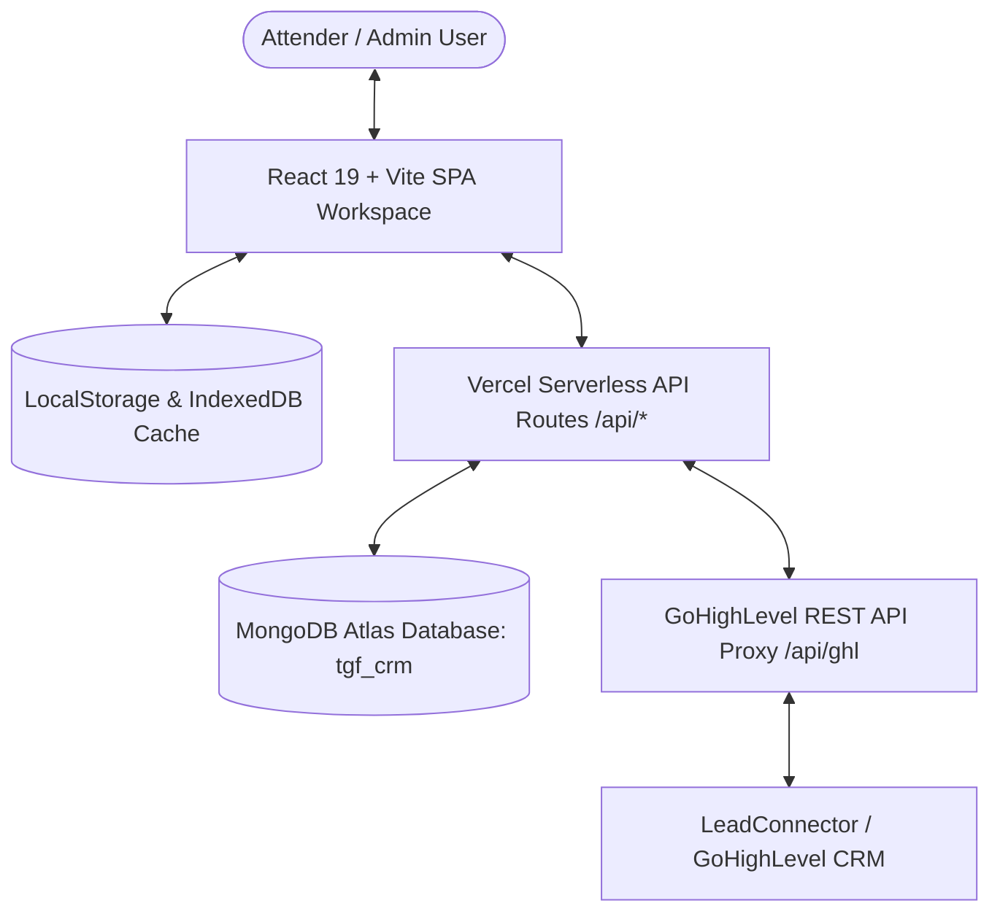
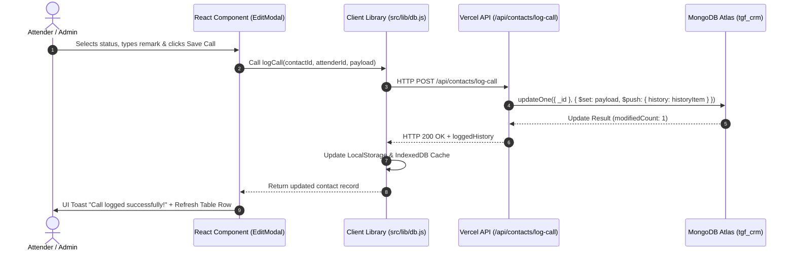
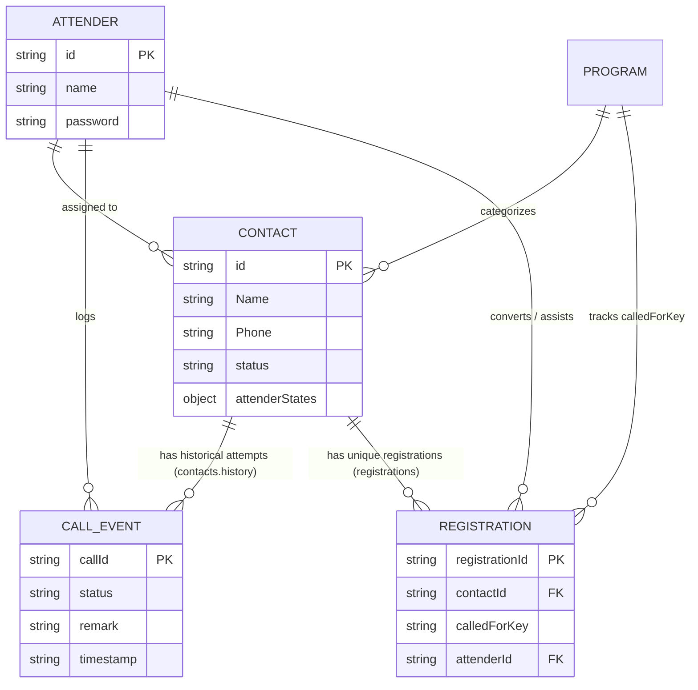
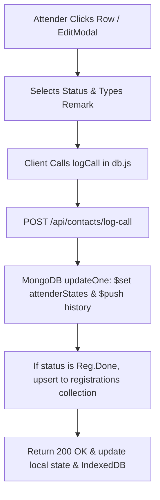

# PROJECT DOCUMENTATION

> ⚠️ Developer Handover Document
>
> This document describes the current implementation of the system.
> Always verify behavior against the code before making architectural changes.

## Quick Start for a New Developer

1. Read: [Architecture](#4-application-architecture)
2. Read: [Database Architecture](#7-database-architecture)
3. Read: [Call & Registration Logic](#9-call-system--very-important)
4. Read: [Reporting & Analytics](#10-reporting--analytics)
5. Read: [API Reference](#13-api-reference)
6. Read: [Safe Modification Guide](#23-safe-modification-guide)

## Most Important Rule

**CALLS and REGISTRATIONS are separate concepts.**

- **Calls** represent individual telecalling interactions (stored in `contacts.history` with `callId`).
- **Registrations** represent actual program registrations (stored in `registrations` collection with `registrationId`).

Never calculate one metric from the other unless explicitly required by the documented business logic.

---

## Document Metadata
- **Documentation Version**: 3.3.0 (Master CRM Architecture V3 — Unified Pipeline Engine & Call Metric Reconciliation)
- **Last Updated**: September 2, 2026
- **Project Version**: 3.3.0 (`tgf-crm-v3`)
- **Primary Repository**: [https://github.com/Gunesh22/tgf-crm-v3.git](https://github.com/Gunesh22/tgf-crm-v3.git)

---

## 1. PROJECT OVERVIEW

### Name & Purpose
**TGF Call Center CRM V3** is an enterprise-grade telecalling management, lead distribution, conversion reporting, and attender performance system built for **Tej Gyan Foundation (TGF)**.

### Target Users
1. **Attenders (Telecallers / Volunteers)**: Perform daily phone follow-ups, record call outcomes, update lead details, send WhatsApp templates, track personal daily targets, and manage callback schedules.
2. **Administrators & Supervisors**: Oversee lead distribution, monitor attender call volume and conversion ratios, manage sub-programs/tags, configure call status rules, reassign workloads, and export financial/registration sheets.

### Primary Workflows
- **Attender Workspace**: Keyboard-optimized contact table with rapid quick filters (`All`, `Hot Leads`, `Follow up`, `Unanswered Callback`, `Today Activity`), phone dialing, and `+ Add Call` modal.
- **Lead Distribution & Tag Sync**: Pull leads from external CRM tags or bulk Excel imports and distribute them dynamically across active attenders.
- **Abhivyakti & Conversion Reporting**: Track shared conversions, primary lead nurturers, assisting attenders, and Khoji types without double counting.
- **Monthly Performance Dashboard**: Aggregates total calls done, connected vs. not connected calls, conversion rates, and attender activity timelines.

### High-Level Architecture Diagram



---

## 2. TECHNOLOGY STACK

| Layer | Technology | Purpose | Location in Codebase |
|---|---|---|---|
| **Frontend Framework** | React `^19.2.8` | Component-driven user interface | `src/` |
| **Build Tool & Bundler** | Vite `^5.4.21` | High-speed ESM development & bundling | `vite.config.js` |
| **Styling System** | TailwindCSS `^4.3.3` | Utility-first responsive dark/light UI | `src/index.css`, `src/App.css` |
| **Icon Library** | Lucide React `^1.34.0` | Accessible UI icons | Components in `src/` |
| **Charts & Visualization** | Recharts `^3.10.1` | Analytics charts & monthly report graphs | `src/features/admin/components/` |
| **Data Export** | XLSX `^0.18.5` | Excel report parsing and `.xlsx` generation | `api/registrations/export.js`, `AbhivyaktiTab.jsx` |
| **Backend API** | Vercel Serverless Functions | Node.js API handlers (`/api/*`) | `api/` |
| **Database** | MongoDB Atlas (Driver `^6.21.0`) | Primary persistent database (`tgf_crm`) | `api/lib/mongodb.js` |
| **Client Storage** | `idb-keyval` `^6.3.0` & LocalStorage | Offline caching & instant UI loading | `src/lib/db.js` |
| **State Management** | React Context (`AuthContext`) | Global user session & auth state | `src/context/AuthContext.jsx` |
| **Hosting Platform** | Vercel | Production hosting & deployment | `vercel.json` |

---

## 3. REPOSITORY STRUCTURE

```text
tgf-crm-v3/
├── api/                             # Backend Vercel Serverless Functions
│   ├── _admin/                      # Internal Admin route handlers
│   │   ├── attenders.js             # Attender CRUD & password management
│   │   ├── programs.js              # Program / tag management
│   │   ├── reassign.js              # Workload reassignment engine
│   │   └── stats.js                 # Global dashboard statistics calculation
│   ├── _contacts/                   # Internal Contact route handlers
│   │   ├── check-duplicate.js       # Fast database duplicate detection (regex/exact)
│   │   ├── create-incoming.js       # Manual incoming lead entry handler
│   │   ├── get-assigned.js          # Attender-assigned leads fetcher
│   │   ├── import-bulk.js           # Bulk lead import processor
│   │   ├── log-call.js              # Atomic call logger & history appender
│   │   ├── search.js                # Search & query engine with pagination
│   │   └── undo-call.js             # Atomic single-level call log rollback
│   ├── admin/
│   │   └── [...slug].js             # Dynamic route router for /api/admin/*
│   ├── contacts/
│   │   └── [...slug].js             # Dynamic route router for /api/contacts/*
│   ├── registrations/
│   │   ├── index.js                 # Registration collection queries
│   │   └── export.js                # Registration sheet exporter
│   ├── ghl.js                       # GoHighLevel API proxy
│   └── lib/
│       └── mongodb.js               # MongoDB connection pool & index manager
├── src/                             # Frontend React Application
│   ├── components/                  # Shared UI components (Select, Modals, Buttons)
│   ├── context/
│   │   └── AuthContext.jsx          # Session state & role authorization
│   ├── features/
│   │   ├── admin/                   # Admin Panel feature components
│   │   │   ├── AdminDashboard.jsx   # Primary Admin container & navigation
│   │   │   ├── ImportContacts.jsx   # CSV/Excel bulk upload component
│   │   │   └── components/          # Admin reporting & setting tabs
│   │   │       ├── AbhivyaktiTab.jsx            # Shared conversions & team assists
│   │   │       ├── MonthlyReportTab.jsx         # Performance analytics tab
│   │   │       ├── DashboardTab.jsx             # Real-time monitoring tab
│   │   │       ├── AttendersTab.jsx             # Attender profiles tab
│   │   │       ├── ProgramsTab.jsx              # Programs & sub-programs tab
│   │   │       ├── SettingsTab.jsx              # Status rules & classification tab
│   │   │       └── AllAttendersSheetTab.jsx     # Master leads table
│   │   ├── attender/                # Attender Workspace feature components
│   │   │   ├── AttenderWorkspace.jsx# Primary Attender container
│   │   │   ├── components/          # Workspace sub-components
│   │   │   │   ├── ContactTable.jsx             # Contact data grid
│   │   │   │   ├── EditModal.jsx                # Lead edit & + Add Call modal
│   │   │   │   ├── AttenderFilters.jsx          # Quick filter bar
│   │   │   │   └── MyPerformanceDashboard.jsx   # Personal performance widget
│   │   │   └── mobile/              # Mobile responsive drawers & views
│   │   └── auth/
│   │       └── LoginScreen.jsx      # Attender & Admin login screen
│   ├── lib/
│   │   ├── db.js                    # Client API wrapper & caching engine
│   │   └── ghl.js                   # Client-side GHL API caller
│   ├── App.jsx                      # Root application router
│   ├── main.jsx                     # Vite entry point
│   └── index.css                    # Design system tokens & Tailwind imports
├── docs/                            # Architecture documentation
├── package.json                     # Node.js dependencies & scripts
├── vercel.json                      # Vercel routing configuration
└── vite.config.js                   # Vite build configuration
```

---

## 4. APPLICATION ARCHITECTURE

### End-to-End Data Flow



---

## 5. FRONTEND ARCHITECTURE

### Routing & Navigation
- Routing is managed conditionally based on `AuthContext`:
  - `role === 'admin'`: Renders `<AdminDashboard />`.
  - `role === 'attender'`: Renders `<AttenderWorkspace />`.
  - `role === null`: Renders `<LoginScreen />`.

### Key Pages & Components

#### 1. `AttenderWorkspace.jsx`
- **Purpose**: Telecaller call center desk.
- **Data Read**: `/api/contacts/get-assigned?attenderId=...`
- **Data Written**: Call attempts, callback dates, status changes, contact edits via `EditModal`.
- **State**: `contacts`, `activeFilter` (`All`, `Hot Leads`, `Follow up`, `Unanswered Callback`, `Today Activity`), `searchQuery`, `selectedProgram`.

#### 2. `EditModal.jsx`
- **Purpose**: Full-screen modal for updating contact details and logging new call notes (`+ Add Call`).
- **Features**: Real-time duplicate detection, historical timeline viewer, custom dynamic field adder, WhatsApp message launcher.

#### 3. `AbhivyaktiTab.jsx`
- **Purpose**: Specialized reporting tab for tracking shared conversions, team assists, and primary nurturers.
- **Data Read**: `/api/registrations`
- **Logic**: Uses `getRegistrationLeadOwner` helper to attribute conversions without double-counting.

#### 4. `MonthlyReportTab.jsx`
- **Purpose**: Admin aggregate performance analytics tab.
- **Metrics**: Total calls attempted, unique calls connected, registration breakdown, call-to-conversion rates.

---

## 6. BACKEND ARCHITECTURE

The backend consists of Vercel Serverless Node.js handlers located in `/api`.

```mermaid
graph LR
    ClientRequest[HTTP Request] --> Router[Vercel Serverless Router]
    Router --> AdminSlug[/api/admin/[...slug].js]
    Router --> ContactSlug[/api/contacts/[...slug].js]
    Router --> RegsAPI[/api/registrations/index.js]
    Router --> GHLProxy[/api/ghl.js]
    
    AdminSlug --> AdminHandlers[api/_admin/*]
    ContactSlug --> ContactHandlers[api/_contacts/*]

    AdminHandlers --> MongoPool[(MongoDB Atlas Pool)]
    ContactHandlers --> MongoPool
    RegsAPI --> MongoPool
```

### Handler Delegation
- `/api/admin/[...slug].js` routes incoming requests to handlers inside `api/_admin/`:
  - `attenders` $\rightarrow$ `api/_admin/attenders.js`
  - `programs` $\rightarrow$ `api/_admin/programs.js`
  - `reassign` $\rightarrow$ `api/_admin/reassign.js`
  - `stats` $\rightarrow$ `api/_admin/stats.js`
- `/api/contacts/[...slug].js` routes incoming requests to handlers inside `api/_contacts/`:
  - `log-call` $\rightarrow$ `api/_contacts/log-call.js`
  - `get-assigned` $\rightarrow$ `api/_contacts/get-assigned.js`
  - `search` $\rightarrow$ `api/_contacts/search.js`
  - `check-duplicate` $\rightarrow$ `api/_contacts/check-duplicate.js`
  - `create-incoming` $\rightarrow$ `api/_contacts/create-incoming.js`
  - `undo-call` $\rightarrow$ `api/_contacts/undo-call.js`

---

## 7. DATABASE ARCHITECTURE

The MongoDB database name is **`tgf_crm`**.

### Collection 1: `contacts`

Stores all lead contact records, current assignment states, root contact attributes, and historical call attempts.

| Field | Type | Required | Purpose |
|---|---|---|---|
| `_id` | ObjectId | Yes | Unique Primary Key |
| `id` | String | Yes | String representation of ID |
| `Name` | String | Yes | Lead full name |
| `Phone` | String | Yes | Raw phone number |
| `normalizedPhone` | String | Yes | 10-digit clean phone string for fast indexing |
| `Mobile` | String | No | Alternate mobile number |
| `normalizedMobile` | String | No | 10-digit clean mobile string |
| `Email` | String | No | Email address |
| `City` | String | No | City |
| `State` | String | No | State |
| `Khoji` | String | No | Khoji type / category |
| `Tags` | String / Array | No | Tags / program labels |
| `Source` | String | No | Lead source (e.g. `Incoming`, `Facebook`, `GHL`) |
| `Called For` | String | No | Current program campaign |
| `programId` | String | Yes | Associated program ID |
| `programName` | String | Yes | Associated program display name |
| `assignedTo` | Array of Strings | Yes | Array of assigned attender IDs |
| `isAssigned` | Boolean | Yes | Assignment status flag |
| `status` | String | Yes | Current overall status (e.g. `Pending`, `Interested`, `Reg.Done`) |
| `remark` | String | No | Latest root remark |
| `callbackDate` | String (ISO) | No | Next callback schedule date |
| `isHotLead` | Boolean | No | Hot lead flag |
| `attenderStates` | Object Map | No | Keyed by `attenderId` $\rightarrow$ per-attender state object |
| `history` | Array of Objects | Yes | Chronological list of call attempt objects (`callId`, `status`, `remark`, `timestamp`) |
| `createdAt` | String (ISO) | Yes | Creation timestamp |
| `updatedAt` | String (ISO) | Yes | Modification timestamp |

#### `contacts` Indexes
```javascript
contacts.createIndex({ assignedTo: 1, updatedAt: -1 });
contacts.createIndex({ assignedTo: 1, status: 1, updatedAt: -1 });
contacts.createIndex({ normalizedPhone: 1 });
contacts.createIndex({ Phone: 1 });
contacts.createIndex({ mobile: 1 });
contacts.createIndex({ Mobile: 1 });
contacts.createIndex({ status: 1 });
contacts.createIndex({ createdAt: -1 });
contacts.createIndex({ updatedAt: -1 });
```

---

### Collection 2: `registrations`

Stores official course/program registration records.

| Field | Type | Required | Purpose |
|---|---|---|---|
| `_id` | ObjectId | Yes | Primary Key |
| `registrationId` | String | Yes | Unique registration ID (`REG-...`) |
| `contactId` | String | Yes | Foreign Key to `contacts` collection |
| `attenderId` | String | Yes | Attender who completed/nurtured the registration |
| `attenderName` | String | Yes | Name of attender |
| `calledFor` | String | Yes | Raw program display name (e.g., `CBT Basic`) |
| `calledForKey` | String | Yes | Normalized program key (e.g., `cbt-basic`) |
| `conversionsource` | String | No | Source of conversion |
| `convertedby` | String | No | Specific attender who performed final conversion |
| `createdAt` | String (ISO) | Yes | Registration timestamp |
| `updatedAt` | String (ISO) | Yes | Update timestamp |

#### `registrations` Compound Unique Index
```javascript
registrations.createIndex(
  { contactId: 1, calledForKey: 1 },
  { unique: true }
);
```

---

### Collection 3: `attenders`

| Field | Type | Required | Purpose |
|---|---|---|---|
| `id` | String | Yes | Unique attender ID |
| `name` | String | Yes | Attender display name |
| `role` | String | Yes | Role (`attender` or `admin`) |
| `password` | String | Yes | Security PIN |
| `isActive` | Boolean | Yes | Active workspace status |

---

### Collection 4: `programs`

| Field | Type | Required | Purpose |
|---|---|---|---|
| `id` | String | Yes | Program unique ID |
| `name` | String | Yes | Program / Tag name |
| `contactCount` | Number | No | Total assigned contacts count |

---

## 8. ENTITY RELATIONSHIPS



---

## 9. MASTER CRM V2 ARCHITECTURE — VERY IMPORTANT

### Three Core Concepts
The CRM rigorously decouples interactions, lead stages, and program participations:

1. **CALL PURPOSE (`callPurpose`)**:
   - `SALES`: Outreach to move a contact through the sales lifecycle. Evaluates pipeline transitions.
   - `QUERY`: Inquiries or helpdesk requests. **NEVER** modifies or demotes `pipelineStage`.
   - `REMINDER`: Event or Shivir notifications. **NEVER** modifies or demotes `pipelineStage`.

2. **PIPELINE STAGE (`pipelineStage`)**:
   - Represents the person's current sales lifecycle stage:
     1. `1. New Lead`
     2. `2. Attempting Contact`
     3. `3. Information Given`
     4. `4. Nurture / Interested`
     5. `5. Future Pool`
     6. `6. Registered / Won`
     * `Closed / Lost` / `Closed / Invalid`
   - **Guardrails**: Backward demotion is strictly blocked (`canTransition`). Query Desk and Existing Alumni are no longer stage promotion targets.

3. **PROGRAM RELATIONSHIPS (`programRelationships[]`)**:
   - Multi-program engagement records stored directly on the contact:
     ```json
     {
       "program": "CBT Basic",
       "status": "Existing Alumni",
       "calledForKey": "cbt-basic",
       "evidenceCallId": "call_123456",
       "updatedAt": "2026-08-29T10:00:00Z"
     }
     ```
   - Alumni outcomes (`Already Reg.d`, `Shivir done`) update `programRelationships[]` rather than overwriting global `pipelineStage`.

---

### Ownership Boundaries: Lead Owner vs Call Attender

1. **`leadOwner` / `leadOwnerName`**:
   - Represents lead ownership. Assigned upon lead creation or initial distribution.
   - **Incoming calls from other attenders do NOT overwrite `leadOwner`.**
   - Transferred **only** via explicit administrative reassignment (`api/_admin/reassign.js`), which appends an audit record to `ownerHistory[]`.

2. **`callAttenderId` / `callAttenderName`**:
   - Recorded on every history entry inside `contacts.history[]`.
   - Preserves snapshot attributes: `leadOwnerAtTime`, `leadOwnerNameAtTime`, `callAttenderId`, `callAttenderName`.

---

### Serverless Idempotent Write Strategy (`pendingProgramRelationship`)

To guarantee data consistency without multi-document transaction overhead in serverless Vercel environments:
- When an outcome generates a `programRelationships` update, `api/_contacts/log-call.js` embeds a `pendingProgramRelationship` sentinel object inside the primary `$set` update.
- A secondary two-op array swap (`$pull` then `$push`) completes the update and clears `pendingProgramRelationship`.
- If the secondary operation fails, `pendingProgramRelationship` remains persisted alongside the logged call history, allowing an automated background reconciliation sweep to detect and retry the missing relationship idempotently.

---

### Strict Attender Context Isolation & Call History Synchronization Architecture

The CRM enforces absolute per-attender working state isolation while maintaining full transparency for past call comments across attenders:

1. **Working Form State Isolation (`attenderStates[attenderId]`)**:
   - Call-entry fields (`Called For`, `status`, `remark`, `callPurpose`, `queryStatus`, `callbackDate`, `callbackTime`) are strictly bound to the active attender's own saved working state (`attenderStates[attenderId]`).
   - When Attender B opens a lead previously worked by Attender A, Attender B's call entry form fields (`Called For`, `status`, `remark`) initialize completely fresh (`""`), preventing ghost autofill or state borrowing across attenders.
   - Root contact profile fields (`Name`, `Phone`, `Mobile`, `Email`, `City`, `State`, `Khoji`, `Tags`, `Source`) normalize from the root lead object while allowing attender-specific source overrides.

2. **Fresh & Empty Call Note Input Field (`remark: ""`)**:
   - The Call Note / Remark textarea field is strictly initialized to empty (`""`) every time the edit modal opens.
   - Attenders can immediately type a fresh call note for today's call without having to manually erase or clear previous comments.

3. **Multi-Attender Synchronized Call History Timeline (`HistoryTimeline`)**:
   - Past call attempts and remarks logged by ALL attenders are preserved in `contacts.history[]`.
   - `mergedHistory` aggregates historical entries from `edited.history`, `savedRow.history`, `savedRow.attenderStates`, and duplicate contact matches (`globalDup.matches`).
   - Every attender can view all past comments logged by other attenders in the **History Timeline** and **Edit Call Logs Modal**, complete with timestamps, attender names, call purposes, and remark details.
   - Save handlers in `EditModal.jsx` and `MobileEditModal.jsx` preserve the complete history array (`baseHistory`) across attenders rather than filtering out other attenders' logs.

4. **Read-Only Shared Lead Banner (`SharedBanner.jsx`)**:
   - Transformed into a 100% read-only informational display indicating other attenders' activity (e.g., `"This contact is also being handled by Attender A (Manisha)"`).
   - Purely informational: **NEVER** mutates or auto-fills form inputs.

5. **Unified Call Status Classification & Dashboard Analytics (`src/features/attender/utils.js`)**:
   - `classifyCallStatus(status)` provides a single canonical logic for determining if a call status is `CONNECTED` vs `NOT_CONNECTED`.
   - Expanded `NOT_CONNECTED_STATUSES` to include `"Not Connected"`, `"not connected"`, `"Not Picked Up"`, `"not picked up"`, `"Busy"`, `"Switched Off"`, etc., eliminating metric Inflation in `MyPerformanceDashboard.jsx`.
   - Default date range filter in `MyPerformanceDashboard.jsx` set to **`"today"`** for immediate daily focus.

6. **Pipeline Key Normalization & Composite State Resolution (`src/utils/pipelineEngine.js`)**:
   - Program keys normalized with `replace(/[\s_-]+/g, "")` to guarantee key equivalence between `"yoga-1-yr"`, `"yoga_1_yr"`, and `"yoga1yr"`.
   - Logical state identity resolved cleanly via `(contact._id, calledForKey, attenderId)`.
   - `normalizeProgramStates` merges pre-existing `programStates` and `programs` maps with incoming call history, preserving stage integrity and preventing data loss.

7. **Robust Follow-Up Date Parsing & Visibility Protections (`CallEntryTab.jsx` & `MobileEditModal.jsx`)**:
   - `formatFollowupDateStr` recursively extracts date values from raw objects (`.date`, `.$date`, `.callbackDate`, `.seconds`, `.iso`), completely eliminating `[object Object]` UI rendering errors.
   - `hasActivePendingFollowup` evaluates to `true` whenever a `callbackDate` is present on a lead (unless explicitly completed or cancelled), ensuring the follow-up management card is always accessible.

---

## 10. REPORTING & ANALYTICS — THREE SEPARATE METRIC CATEGORIES

Reports in `api/_admin/stats.js` strictly isolate three distinct counting units:

| Metric Category | Source Collection | Counting Unit | Purpose |
|---|---|---|---|
| **A. Call Events** | `contacts.history[]` | `callId` | Volume of phone calls made (Sales, Query, Reminder, Connected vs. Unconnected). |
| **B. Pipeline People** | `contacts` | `pipelineStage` per contact | Unique count of people in each sales lifecycle stage (1 contact = 1 person). |
| **C. Registrations** | `registrations` | `registrationId` | Unique confirmed program registrations (`contactId` + `calledForKey`). |

> [!WARNING]
> Never conflate Call Events with Pipeline People or Registrations. A single lead with 5 calls and 1 registration equals 5 Call Events, 1 Pipeline Person, and 1 Registration.

---

## 11. SETTINGS SYSTEM

Located in `<SettingsTab />` and sub-cards:

1. **Status Rules (`StatusClassificationCard.jsx`)**:
   - Classifies statuses into **Connected** (e.g. `Interested`, `Information Given`, `Reg.Done`) vs. **Not Connected** (e.g. `Ringing`, `Busy`, `Switched Off`).
2. **Compulsory Field Bypass (`CompulsoryFieldBypassCard.jsx`)**:
   - Toggles whether remarks/callbacks are mandatory before saving call logs.
3. **Attender Password Manager (`AdminPasswordCard.jsx`)**:
   - Updates administrative master password (`198219`) and individual attender PINs.
4. **WhatsApp Templates (`WhatsAppTemplatesCard.jsx`)**:
   - Manages pre-formatted WhatsApp message triggers.

---

## 12. AUTHENTICATION & SECURITY

- **Attender Authentication**:
  - Attenders log in using their Name or Attender ID + PIN.
  - Emergency master bypass PIN: **`123456`**.
- **Admin Authentication**:
  - Log in using ID `admin` and passcode **`198219`** (or `123456`).
- **Security Constraints**:
  - API routes validate presence of parameters.
  - Secret tokens (`GHL_TOKEN`, `MONGODB_URI`) are processed server-side in Vercel Serverless Functions.

---

## 13. API REFERENCE

### Contacts Endpoints

#### `POST /api/contacts/log-call`
- **Purpose**: Atomically log a call attempt, update contact state, and append history.
- **Request Body**:
  ```json
  {
    "contactId": "650a8b9c...",
    "attenderId": "9VZZnV00X63PzUSaGTgq",
    "attenderName": "Manisha",
    "status": "Interested",
    "remark": "Asked about batch timing",
    "calledFor": "CBT Basic"
  }
  ```
- **Response**: `{ "success": true, "modifiedCount": 1, "loggedHistory": { ... } }`

#### `GET /api/contacts/get-assigned?attenderId=...`
- **Purpose**: Fetch contacts assigned to a specific attender.

#### `GET /api/contacts/search?month=...&limit=...`
- **Purpose**: Paginated search engine for contacts database.

#### `GET /api/contacts/check-duplicate?phone=...`
- **Purpose**: Rapid regex/exact phone duplicate lookup across global database.

---

### Registrations Endpoints

#### `GET /api/registrations?month=2026-08`
- **Purpose**: Returns registration documents for specified month.

---

### Admin Endpoints

#### `GET /api/admin/attenders`
- **Purpose**: Returns active attenders list.

#### `POST /api/admin/reassign`
- **Purpose**: Atomically reassign workload from one attender to another.

#### `ALL /api/ghl`
- **Purpose**: Server proxy for GoHighLevel REST API queries.

---

## 14. CRITICAL FUNCTIONS

| Function | File Location | Purpose |
|---|---|---|
| `ensureIndexes(db)` | `api/lib/mongodb.js` | Verifies and builds all MongoDB index suites including unique compound constraints. |
| `logCall(...)` | `src/lib/db.js` | Frontend client wrapper for calling `/api/contacts/log-call`. |
| `classifyCallStatus(status)` | `src/features/attender/utils.js` | Standardizes call outcome classification into `CONNECTED` vs `NOT_CONNECTED`. |
| `normalizeKey(str)` | `src/utils/pipelineEngine.js` | Normalizes program keys by removing spaces, hyphens, and underscores for symmetrical lookups. |
| `checkGlobalDuplicate(...)` | `src/lib/db.js` | 0ms local cache + instant database duplicate checker. |
| `getRegistrationLeadOwner(...)` | `AbhivyaktiTab.jsx` | Attribute shared registrations between primary nurturers and assisting attenders. |

---

## 15. DATA FLOW DOCUMENTATION

### Recording a Call Event



---

## 16. CACHING

- **LocalStorage Keys**:
  - `attender_call_logs_<attenderId>`: Cached assigned contacts for offline/instant initial render.
  - `abhivyakti_registrations_cache`: Cached registrations data.
- **IndexedDB**:
  - Key-value store via `idb-keyval` for large contact datasets.
- **Cache Purging**:
  - Admin panel provides "Purge Local Cache & Re-Sync" buttons across tabs.

---

## 17. ERROR HANDLING

- **GHL Proxy Fallback**: If `GHL_TOKEN` is missing, `/api/ghl` returns status `200` with `{ configured: false }` to prevent 500 server crashes.
- **Database Retries**: Client API calls automatically attempt cache fallback if network fails.

---

## 18. ENVIRONMENT VARIABLES

| Variable | Required | Purpose | Exposed to Frontend? |
|---|---|---|---|
| `MONGODB_URI` | Yes | MongoDB Atlas connection string | No (Server only) |
| `GHL_TOKEN` | Optional | GoHighLevel API Private Integration Token | No (Server only) |
| `GHL_LOCATION_ID` | Optional | GoHighLevel Location ID | No (Server only) |
| `GHL_VERSION` | Optional | GoHighLevel API Version (`2021-07-28`) | No (Server only) |
| `VITE_GHL_TOKEN` | Optional | Client-side fallback token | Yes |

---

## 19. DEPLOYMENT

- **Platform**: Vercel Serverless
- **Build Command**: `npm run build` (`vite build`)
- **Output Directory**: `dist`
- **Environment**: Node.js ESM environment (`"type": "module"` in `package.json`).

---

## 20. LOCAL DEVELOPMENT

1. Clone repository: `git clone https://github.com/Gunesh22/tgf-crm-v3.git`
2. Install dependencies: `npm install`
3. Set environment variable in `.env.local`: `MONGODB_URI=mongodb+srv://...`
4. Start local development server: `npm run dev`
5. Open browser at `http://localhost:5173`

---

## 21. TESTING

### Automated Unit & Behavioral Test Suite
Run the full 124-test verification suite:
```bash
npm test
```
This executes:
- `tests/pipelineEngine.test.js` (95 pipeline transition, key normalization & rule tests)
- `tests/allProductionAuditTests.test.js` (29 behavioral & audit domain tests)

### Read-Only Reconciliation & Migration Scripts
- **Registration Reconciliation Report**:
  ```bash
  node --env-file=.env scripts/reg-reconciliation.js
  ```
  Generates a read-only classification of all historical `Reg.Done` evidence without modifying database state.

- **Legacy Migration Dry-Run**:
  ```bash
  node --env-file=.env scripts/migration-dry-run.js
  ```
  Produces a JSON report (`scratch/migration-report-v2-*.json`) classifying legacy records with explicit evidence details. *Never pass `--write` until dry-run reports are audited.*

### Recommended Manual Smoke Test Suite
1. Log in as `Manisha` using PIN `629001` (or master PIN `123456`).
2. Open Attender Workspace and apply filter `Hot Leads`.
3. Open `+ Add Call` modal for a contact and save a call attempt.
4. Verify call note appears in history timeline.
5. Log in as `admin` using password `123456`.
6. Navigate to `Abhivyakti` tab and verify registration counts.

---

## 22. KNOWN GOTCHAS & THINGS NEW DEVELOPERS MUST NOT BREAK

1. **Call vs. Registration Distinction**: Never modify reports to count registrations from `contacts.history`.
2. **MongoDB Compound Index**: Do not drop the `{ contactId: 1, calledForKey: 1 }` unique index on `registrations`.
3. **Attender PIN Override**: Always preserve emergency PIN `123456` in authentication checks.

---

## 23. SAFE MODIFICATION GUIDE

| I want to change... | Start Here | Also Check |
|---|---|---|
| **Call Logging Logic** | `api/_contacts/log-call.js` | `src/features/attender/components/EditModal.jsx` |
| **Registration Schema** | `api/lib/mongodb.js` | `api/registrations/index.js` |
| **Abhivyakti Table & Metrics** | `src/features/admin/components/AbhivyaktiTab.jsx` | `src/features/admin/AdminDashboard.jsx` |
| **Attender Workload Reassignment**| `api/_admin/reassign.js` | `src/features/admin/components/ReassignModal.jsx` |
| **GoHighLevel API Integration** | `api/ghl.js` | `src/lib/ghl.js` |

---

## 24. ARCHITECTURAL RULES

1. Do not calculate registrations from call history.
2. Do not treat every `Reg.Done` call attempt as a new registration.
3. Always update `contacts.history` with unique `callId`s.
4. Keep client LocalStorage cache in sync after API mutations.

---

## 25. DOCUMENTATION MAINTENANCE

Whenever backend API routes, database schemas, index definitions, or reporting rules are updated, this document MUST be updated accordingly.

*Documentation maintained by TGF Development Team.*
